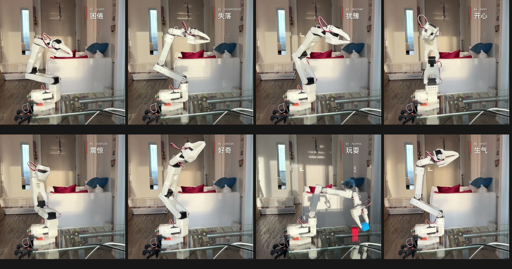

# 机械臂也能表达情绪

用 SO-ARM101 的姿态、朝向、节奏和停顿，表演八种情绪与交流意图。

[观看八段实拍](https://muurrphy.github.io/desktop-robot-murphy-demo/expressions/) · [统一作品集](https://muurrphy.github.io/desktop-robot-murphy-demo/portfolio/) · [English](README.md)

正式动作由刘美辰亲手遥操编舞。AI 辅助持续记录、排错、语义裁剪和工具实现；每条候选都在实机上回放，确认以后才归档。项目受到 Apple ELEGNT 台灯研究启发，也研究了拉班动作分析、角色动画、木偶、动物身体语言和手语中的视觉交流组织。

保留的动作是困倦、失落、犹豫、开心、震惊、好奇、玩耍、生气。玩耍的积木搭放成功时，可以读作邀请；失败时，可以读作求助。这是表演情境，不是机器人自主识别搭放结果。

安装 `python -m pip install .` 后，运行 `expressive-arm list` 查看动作，`expressive-arm validate` 校验数据。`inspect` 查看关节范围与时长，`plot` 导出轨迹图，`crop` 手动选段。上述命令都不连接机械臂。

实际录制与回放工具保存在 `tools/recording`。请先阅读 [录制流程](docs/recording.md)，使用自己的串口和已存档校准 ID。结束录制不等于断开控制或卸力；回放结束保留末尾姿态，不把归位动作混进表情。

代码与动作数据采用 MIT 许可；实拍影像保留作者版权，供作品集观看。没有公开本地对话、设备序列号或校准文件。当前没有观众盲测，不宣称所有人都能识别这些情绪，也没有实现手语翻译。

录制工具保留了早期 AI 生成的 25 种参考模板，供离线比较；它们不是本包正式归档的八条人工表演。
